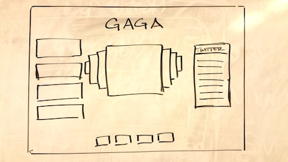
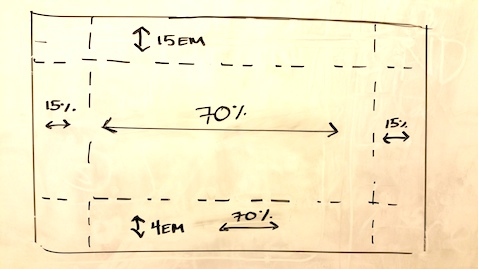
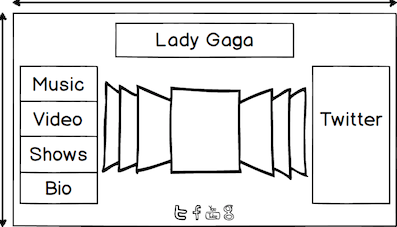
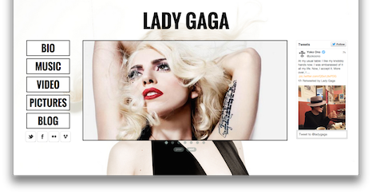

#GAGA SAMPLE SITE

###Description:
This an example of my work,  I have included the wireframes so that you can see my process, I have also made this site in two versions a Lady Gaga Version (click here to view), and The Lego Movie Version (click here to view) to show that my designs and functionallity translates to any "product".  I hope you enjoy them and please feel free to contact me with suggestions.  

###Original wireframe

###Div % and height ems

###Mockup of Site

###Finished Product

####Created By: Michael Angelo
* Website: http://yamikamisama.github.io/
* Linkedin: https://www.linkedin.com/pub/michael-angelo/9a/a93/1b0/
* Github: https://github.com/Yamikamisama
* Facebook: https://www.facebook.com/michael.angelo.14418
* Twitter: https://twitter.com/LordMikeAng
* Email: michaelangelodecarlo@gmail.com
